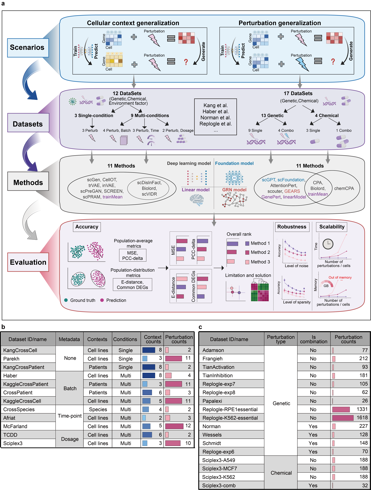

Single-cell perturbation benchmark (scPerturBench)
## Introduction
Various computational methods have been developed to predict perturbation effects, but despite claims of promising performance, concerns about the true efficacy of these models continue to be raised, particularly when the models are evaluated across diverse unseen cellular contexts and unseen perturbations. To address this, a comprehensive benchmark was conducted for 21 single-cell perturbation response prediction methods, including methods concerning genetic and chemical perturbations; 29 datasets were used, and various evaluation metrics were applied to assess the generalizability of the methods to unseen cellular contexts and perturbations. Recommendations regarding the method limitations, method generalization and method selection were obtained. Finally, an applicable solution that leverages prior knowledge through cellular context embedding to improve the generalizability of models to new cellular contexts is presented.
## Workflow



## Cellular context generalization scenario
In the cellular context generalization scenario, we evaluate the prediction of known perturbations in previously unobserved cellular contexts. Specifically, we assessed the accuracy of 10 published methods and the trainMean baseline model across 12 datasets using four evaluation metrics including MSE, PCC-delta, E-distance, and common DEGs. The cellular context generalization scenario can be further divided into two distinct test settings based on the partitioning of the training and test datasets: i.i.d (independent and identically distributed or in-distribution) and o.o.d (out-of-distribution) setting. [i.i.d](https://github.com/bm2-lab/scPerturBench/tree/main/Cellular_context_generalization/i.i.d) contained the script used in the i.i.d setting. [o.o.d](https://github.com/bm2-lab/scPerturBench/tree/main/Cellular_context_generalization/o.o.d) contained the script used in the o.o.d setting. [calPerformance](https://github.com/bm2-lab/scPerturBench/tree/main/Cellular_context_generalization/calPerformance_delta.py) and [Utils](https://github.com/bm2-lab/scPerturBench/tree/main/Cellular_context_generalization/Util.py) is the script for performance calculation and generic function。


## Perturbation generalization scenario
In the perturbation generalization scenario, we assess the ability of models to predict the effects of previously unobserved perturbations within a specific cellular context. Depending on the type of perturbation, this scenario can be further divided into two categories: genetic perturbation effects prediction and chemical perturbation effects prediction. (1) Genetic perturbation effect prediction. (2) Chemical perturbation effect prediction. [Genetic](https://github.com/bm2-lab/scPerturBench/tree/main/Perturbation_generalization/Genetic) contained the script used in the genetic setting. [Chemical](https://github.com/bm2-lab/scPerturBench/tree/main/Perturbation_generalization/Chemical) contained the script used in the chemical setting. [calPerformance](https://github.com/bm2-lab/scPerturBench/tree/main/Perturbation_generalization/calPerformance.py) and [Utils](https://github.com/bm2-lab/scPerturBench/tree/main/Perturbation_generalization/Util1.py) is the script for performance calculation and generic function。

## bioLord-emCell
We posit that improving generalization in the cellular context generalization scenario requires models to effectively capture the heterogeneity in perturbation responses across cellular contexts. This can be achieved in one of two main ways: (1) training on large-scale, diverse datasets to directly learn heterogeneity or (2) leveraging existing prior knowledge. Given the scarcity of large-scale cellular perturbation datasets, the second approach is more feasible.Therefore, we propose a generalizable and applicable framework to improve model generalizability across different cellular contexts via cell line embedding and disentanglement representation. [bioLord-emCell](https://github.com/bm2-lab/scPerturBench/tree/main/bioLord-emCell) contained the script we used to implement our framework. 

We recommend using Anaconda / Miniconda to create a conda environment for using biolord-emCell. You can create a python environment using the following command:
```python
conda env create -f environment.yml
```


For more details, please refer to our manuscript.


## Benchmark datasets summary
All datasets analyzed in our study are listed in the [Workflow](imgs/fig1.png). We have uploaded all benchmark datasets to Figshare and Zenodo, which can be obtained from [Figshare-Cellular](https://doi.org/10.6084/m9.figshare.28143422), [Figshare-Perturbation](https://doi.org/10.6084/m9.figshare.28147883), [Zenodo-Cellular](https://doi.org/10.5281/zenodo.14607156) and [Zenodo-perturbation](https://10.5281/zenodo.14638779).

## Benchmark methods
All benchmark methods analyzed in our study are listed below. Details of the setting were available in our manuscript. 

| Method                                                                         | Article                                                                   | Time |Title |
|-----------------------------------------|-------------------------------------|------| -------------------------------------| 
| [bioLord](https://github.com/nitzanlab/biolord)                               | [Nature Biotechnology](https://www.nature.com/articles/s41587-023-02079-x)        | 2024 |Disentanglement of single-cell data with biolord|
| [CellOT](https://github.com/bunnech/cellot)                            | [Nature Methods](https://www.nature.com/articles/s41592-023-01969-x)                        | 2023 |Learning single-cell perturbation responses using neural optimal transport|
| [inVAE](https://github.com/LiouCharlie/INVAE/)                           | [Bioengineering](https://www.mdpi.com/2306-5354/10/9/996)                        | 2023 |Homogeneous Space Construction and Projection for Single-Cell Expression Prediction Based on Deep Learning|
| [scDisInFact](https://github.com/ZhangLabGT/scDisInFact)                             | [Nature Communications](https://www.nature.com/articles/s41467-024-45227-w)          | 2024 |scDisInFact: disentangled learning for integration and prediction of multi-batch multi-condition single-cell RNA-sequencing data|
| [scGen](https://github.com/theislab/scgen)                                | [Nature Methods](https://www.nature.com/articles/s41592-019-0494-8)              | 2019 |scGen predicts single-cell perturbation responses|
| [scPRAM](https://github.com/jiang-q19/scPRAM)                                          | [Bioinformatics](https://academic.oup.com/bioinformatics/article/40/5/btae265/7646141)               | 2024 |scPRAM accurately predicts single-cell gene expression perturbation response based on attention mechanism|
| [scPreGAN](https://github.com/XiajieWei/scPreGAN)                             | [Bioinformatics](https://academic.oup.com/bioinformatics/article/38/13/3377/6593485)          | 2022 |scPreGAN, a deep generative model for predicting the response of single-cell expression to perturbation|
| [SCREEN](https://github.com/Califorya/SCREEN) | [Frontiers of Computer Science](https://link.springer.com/article/10.1007/s11704-024-31014-9)              | 2024 |SCREEN: predicting single-cell gene expression perturbation responses via optimal transport|
| [scVIDR](https://github.com/BhattacharyaLab/scVIDR)                                        | [Patterns](https://www.cell.com/patterns/fulltext/S2666-3899(23)00186-1)          | 2023 |Generative modeling of single-cell gene expression for dose-dependent chemical perturbations|
| [trVAE](https://github.com/theislab/trVAE)                                        | [Bioinformatics](https://academic.oup.com/bioinformatics/article/36/Supplement_2/i610/6055927)         | 2020 |Conditional out-of-distribution generation for unpaired data using transfer VAE|
| [AttentionPert](https://github.com/BaiDing1234/AttentionPert)                        | [Bioinformatics](https://academic.oup.com/bioinformatics/article/40/Supplement_1/i453/7700899)        | 2021 |AttentionPert: Accurately Modeling Multiplexed Genetic Perturbations with Multi-scale Effects |
| [CPA](https://github.com/theislab/cpa)                                   | [Molecular Systems Biology](https://www.embopress.org/doi/full/10.15252/msb.202211517) | 2023 |Predicting cellular responses to complex perturbations in high-throughput screens|
| [GEARS](https://github.com/snap-stanford/GEARS)                                     | [Nature Biotechnology](https://www.nature.com/articles/s41587-023-01905-6)      | 2022 |Predicting transcriptional outcomes of novel multigene perturbations with GEARS|
| [GenePert](https://github.com/zou-group/GenePert)                                    | [bioRxiv](https://www.biorxiv.org/content/10.1101/2024.10.27.620513v1)        | 2024 |GenePert: Leveraging GenePT Embeddings for Gene Perturbation Prediction|
| [linearModel](https://github.com/const-ae/linear_perturbation_prediction-Paper)                            | [bioRxiv](https://doi.org/10.1101/2024.09.16.613342)                        | 2024 |Deep learning-based predictions of gene perturbation effects do not yet outperform simple linear methods|
| [scGPT](https://github.com/bowang-lab/scGPT)                                             | [Nature Methods](https://www.nature.com/articles/s41592-024-02201-0)              | 2024 |scGPT: toward building a foundation model for single-cell multi-omics using generative AI|
| [scFoundation](https://github.com/biomap-research/scFoundation)                               | [Nature Methods](https://www.nature.com/articles/s41592-024-02305-7)              | 2024 |Large-scale foundation model on single-cell transcriptomics|
| [chemCPA](https://github.com/theislab/chemCPA)                                  | [arXiv](https://arxiv.org/abs/2204.13545)              | 2022 |Predicting Cellular Responses to Novel Drug Perturbations at a Single-Cell Resolution|
| [scouter](https://github.com/PancakeZoy/scouter)                              | [bioRxiv](https://doi.org/10.1101/2024.12.06.627290)       | 2024 |Scouter: Predicting Transcriptional Responses to Genetic Perturbations with LLM embeddings|


## Citation
Zhiting Wei, Yiheng Wang, Yicheng Gao, Qi Liu et al. Recommendations and solutions for generalizable single-cell perturbation response prediction obtained from a systematic benchmark, submitted, 2025.
## Contacts
bm2-lab@tongji.edu.cn, 1810546@tongji.edu.cn


