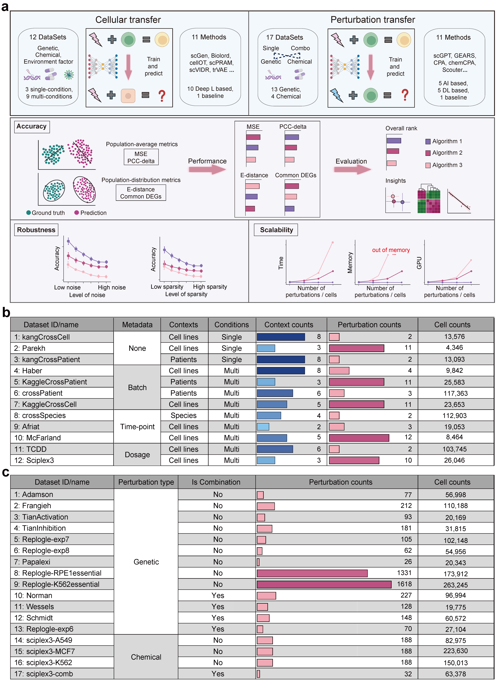

# scPerturBench, Single-cell perturbation effects prediciton benchmark
## Introduction
Various computational methods have been developed to predict perturbation effects, while despite claims of promising performance, great concerns on the true efficacy of these models have been raised, particularly when evaluated across diverse unseen cellular contexts and unseen perturbations. To this end, a comprehensive benchmark of 21 single-cell perturbation response prediction methods including genetic and chemical perturbations, with 29 datasets for the method generalization in unseen cellular contexts and unseen perturbations, using different evaluation metrics, were conducted. Tips regarding the method limitations, method generalizations and method selections were presented. Finally, an applicable solution by leveraging prior knowledge through cellular context embedding to achieve improved model generalization in new cellular context is presented. 

## Workflow

## Cellular context generalization scenario
In the cellular context generalization scenario, we evaluate the prediction of known perturbations in previously unobserved cellular contexts. Specifically, we assessed the accuracy of 10 published methods and the trainMean baseline model across 12 datasets using four evaluation metrics: MSE, PCC-delta, E-distance, and common DEGs. The cellular context generalization scenario can be further divided into two distinct test settings based on the partitioning of the training and test datasets: i.i.d (independent and identically distributed or in-distribution) and o.o.d (out-of-distribution) setting. [i.i.d](https://github.com/bm2-lab/scPerturBench/tree/main/Cellular_context_generalization/i.i.d) contained the script used in the i.i.d setting. [o.o.d](https://github.com/bm2-lab/scPerturBench/tree/main/Cellular_context_generalization/o.o.d) contained the script used in the o.o.d setting. [calPerformance](https://github.com/bm2-lab/scPerturBench/tree/main/Cellular_context_generalization/calPerformance_delta.py) and [Utils](https://github.com/bm2-lab/scPerturBench/tree/main/Cellular_context_generalization/Util.py) is the script for performance calculation and generic function。

## Perturbation generalization scenario
In the perturbation generalization scenario, we assess the ability of models to predict the effects of previously unobserved perturbations within a specific cellular context. Depending on the type of perturbation, this scenario can be further divided into two categories: genetic perturbation effects prediction and chemical perturbation effects prediction. (1) Genetic perturbation effect prediction. (2) Chemical perturbation effect prediction. [Genetic](https://github.com/bm2-lab/scPerturBench/tree/main/Perturbation_generalization/Genetic) contained the script used in the genetic setting. [Chemical](https://github.com/bm2-lab/scPerturBench/tree/main/Perturbation_generalization/Chemical) contained the script used in the chemical setting. [calPerformance](https://github.com/bm2-lab/scPerturBench/tree/main/Perturbation_generalization/calPerformance.py) and [Utils](https://github.com/bm2-lab/scPerturBench/tree/main/Perturbation_generalization/Util1.py) is the script for performance calculation and generic function。

## Benchmark datasets summary
All datasets analyzed in our study are listed in the [Workflow](imgs/fig1_v3.png). We have uploaded all benchmark datasets to Figshare and Zenodo, which can be obtained from [Figshare-Cellular](https://doi.org/10.6084/m9.figshare.28143422), [Figshare-Perturbation](https://doi.org/10.6084/m9.figshare.28147883), [Zenodo-Cellular](https://doi.org/10.5281/zenodo.14607156) and [Zenodo-perturbation](https://doi.org/10.5281/zenodo.14607156).

## Benchmark Methods
All benchmark methods analyzed in SCMMIB study are listed below. Details of these methods were available in our Register Report Stage 1 manuscript in [figshare folder](https://springernature.figshare.com/articles/journal_contribution/Benchmarking_single-cell_multi-modal_data_integrations/26789572).

| Method                                                                         | Article                                                                   | Time |
|--------------------------------------------------------------------------------|---------------------------------------------------------------------------|------|
| [bioLord](https://github.com/nitzanlab/biolord)                               | [Nature Biotechnology](https://www.nature.com/articles/s41587-023-02079-x)                        | 2024 |
| [CellOT](https://github.com/bunnech/cellot)                            | [Nature Methods](https://www.nature.com/articles/s41592-023-01969-x)                        | 2023 |
| [inVAE](https://github.com/LiouCharlie/INVAE/)                           | [Bioengineering](https://www.mdpi.com/2306-5354/10/9/996)                        | 2023 |
| [scDisInFact](https://github.com/ZhangLabGT/scDisInFact)                             | [Nature Communications](https://www.nature.com/articles/s41467-024-45227-w)          | 2024 |
| [scGen](https://github.com/theislab/scgen)                                | [Nature Methods](https://www.nature.com/articles/s41592-019-0494-8)              | 2019 |
| [scPRAM](https://github.com/jiang-q19/scPRAM)                                          | [Bioinformatics](https://academic.oup.com/bioinformatics/article/40/5/btae265/7646141)               | 2024 |
| [scPreGAN](https://github.com/XiajieWei/scPreGAN)                             | [Bioinformatics](https://academic.oup.com/bioinformatics/article/38/13/3377/6593485)          | 2022 |
| [SCREEN](https://github.com/Califorya/SCREEN) | [Frontiers of Computer Science](https://link.springer.com/article/10.1007/s11704-024-31014-9)              | 2024 |
| [scVIDR](https://github.com/BhattacharyaLab/scVIDR)                                        | [Patterns](https://www.cell.com/patterns/fulltext/S2666-3899(23)00186-1)          | 2023 |
| [trVAE](https://github.com/theislab/trVAE)                                        | [Bioinformatics](https://academic.oup.com/bioinformatics/article/36/Supplement_2/i610/6055927)         | 2020 |
| [AttentionPert](https://github.com/BaiDing1234/AttentionPert)                        | [Bioinformatics](https://academic.oup.com/bioinformatics/article/40/Supplement_1/i453/7700899)        | 2021 |
| [CPA](https://github.com/theislab/cpa)                                   | [Molecular Systems Biology](https://www.embopress.org/doi/full/10.15252/msb.202211517) | 2023 |
| [GEARS](https://github.com/snap-stanford/GEARS)                                     | [Nature Biotechnology](https://www.nature.com/articles/s41587-023-01905-6)      | 2022 |
| [GenePert](https://github.com/zou-group/GenePert)                                    | [bioRxiv](https://www.biorxiv.org/content/10.1101/2024.10.27.620513v1)        | 2024 |
| [linearModel](https://github.com/const-ae/linear_perturbation_prediction-Paper)                            | [bioRxiv](https://doi.org/10.1101/2024.09.16.613342)                        | 2024 |
| [scGPT](https://github.com/bowang-lab/scGPT)                                             | [Nature Methods](https://www.nature.com/articles/s41592-024-02201-0)              | 2024 |
| [scFoundation](https://github.com/biomap-research/scFoundation)                               | [Nature Methods](https://www.nature.com/articles/s41592-024-02305-7)              | 2024 |
| [chemCPA](https://github.com/theislab/chemCPA)                                  | [arXiv](https://arxiv.org/abs/2204.13545)              | 2022 |
| [scouter](https://github.com/PancakeZoy/scouter)                              | [bioRxiv](https://doi.org/10.1101/2024.12.06.627290)       | 2024 |

## Citation
Zhiting Wei, Yiheng Wang, Yicheng Gao, Qi Liu et al. Tips and solutions for generalizable single-cell perturbation response prediction gained from a systematic benchmark, submitted, 2025.
## Contacts
bm2-lab@tongji.edu.cn, 1810546@tongji.edu.cn

